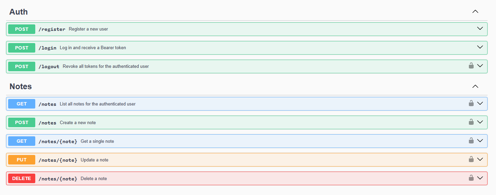

<p align="center">

</p>

<p align="center">


</p>

## Notes API

Notes API is a RESTful API built with Laravel for managing personal notes.  This project provides a secure, scalable foundation for note-taking applications, complete with built-in authentication and interactive API documentation.

## Main features

- **User Authentication:** Secure, token-based access control using [Laravel Sanctum](https://laravel.com/docs/sanctum).
- **Notes Management:** Complete CRUD operations for notes, scoped to the authenticated user.
- **Automated Testing:** Comprehensive test coverage ensuring reliability and stability using **PHPUnit**.
- **Interactive Documentation:** Ready-to-use API docs made with Swagger UI
- **Policy-based authorization** and **Form Request validation**
- The project follows clean architecture principles and utilizes design patterns including the Repository and Service layers
- Background job processing using Laravel queue workers and event-driven logging

## Installation

Follow these steps to get the Notes API up and running locally.

```bash
git clone https://github.com/msiemdaj/NotesAPI.git
cd NotesAPI
```

### Install Dependencies
```bash
composer install
```

### Environment Setup
Configure your environment variables in `.env` (copy from `.env.example`) before running migrations.

```bash
cp .env.example .env
```

```bash
php artisan key:generate
```

### Run Migrations

```bash
php artisan migrate
```

## Running the Application

Run the following command to start the application locally

```bash
php artisan serve
```

## Queue Configuration
This application uses Laravel queues to handle background tasks such as event logging.

Make sure your `.env` file is configured with a queue driver, for example: `QUEUE_CONNECTION=database`
To run the queue worker use the artisan command:

```bash
php artisan queue:work
```

## Documentation

Full interactive API documentation is provided by **Swagger UI**. You can explore, review, and test all available endpoints directly from your browser.

Once your local server is running, navigate to: `/docs`



## Testing

This application uses Laravel's built-in testing tools powered by **PHPUnit**.

```bash
php artisan test
```

## License

Notes API is open-sourced software licensed under the [MIT license](https://opensource.org/licenses/MIT).
